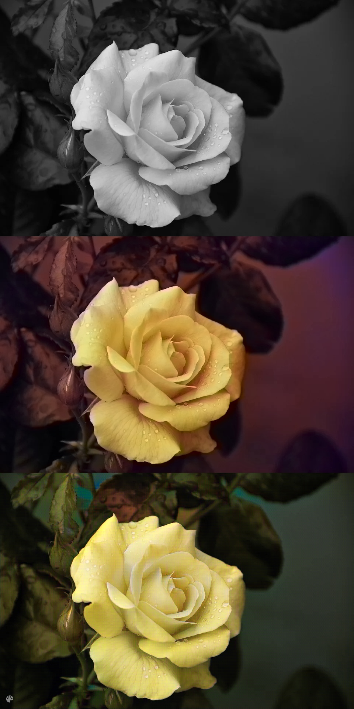
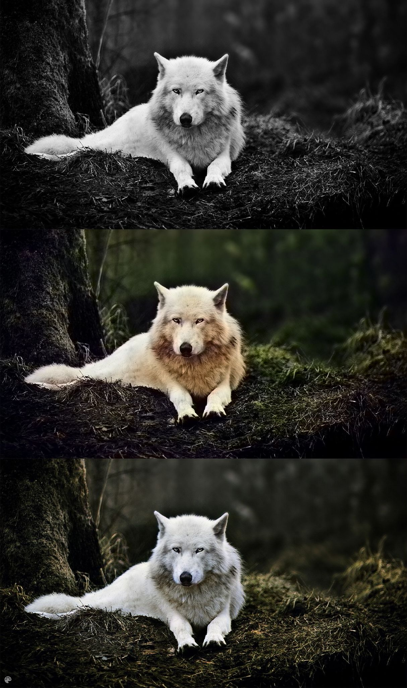
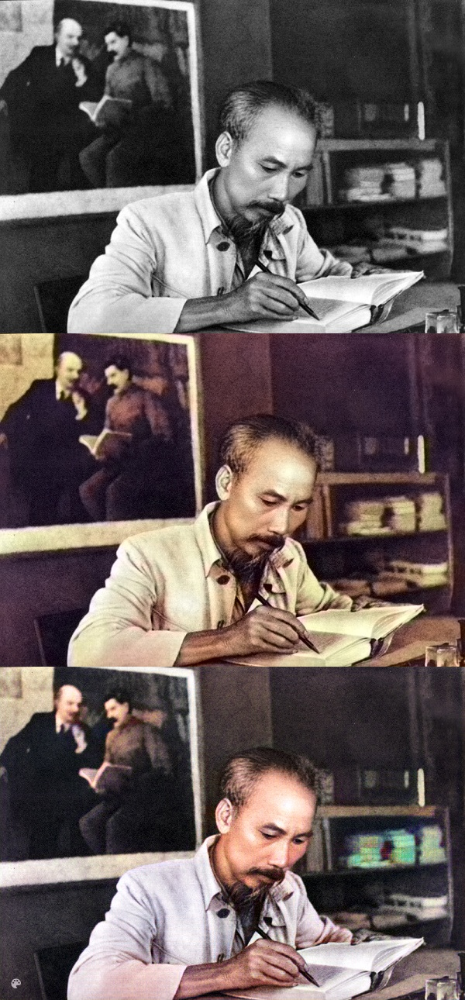
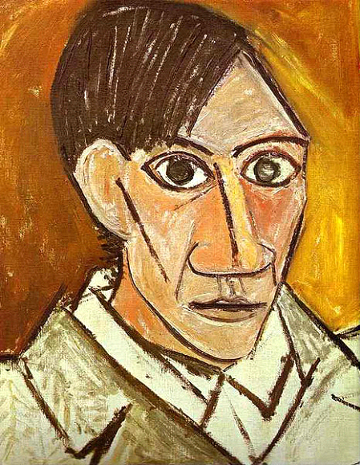
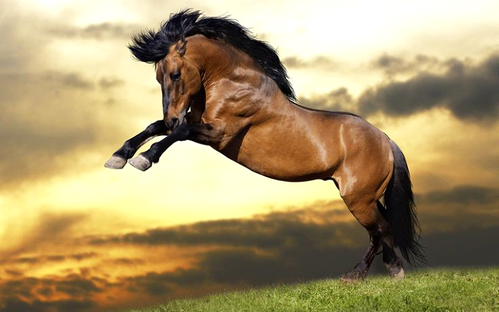
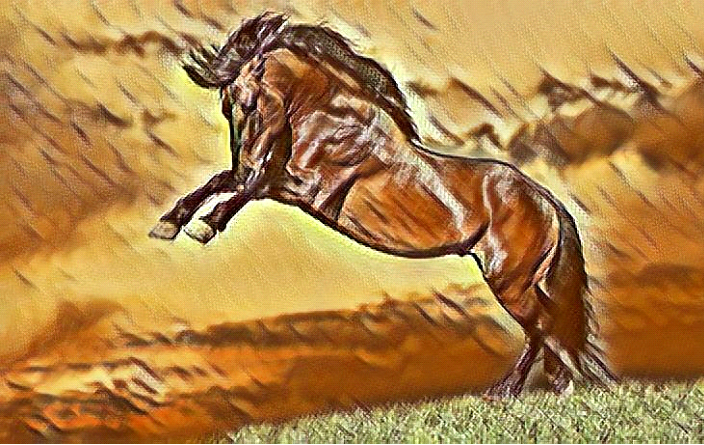

# Colorization and Style Transfer
 Project Machine learning in AI training course Vinbigdata. Working in group to make an end-to-end system to colorize gray image, then apply style transfer.

link model: https://drive.google.com/file/d/1HbBlhSZOlJNQ_uveVP0xoD7Xx2v4CyOJ/view?usp=sharing

# install requirements
pip install -r requirements.txt

# run server interminal 1
python main_fastapi.py

# run font end in terminal 2
python font_end.py

streamlit run font_end.py

# Demo colorization

  
  
   
  <i>colorization demo (from top to bottom: gray image, colorized image 1, colorized image 2)</i>

# Demo style transfer

  
  
   
  <i>style transfer demo (from left to right: style, original image, style transfered image)</i>

# Demo video colorization then style transfer

   
  <i>Result</i>

# Acknowledge
This project is done by 5-mem group.
